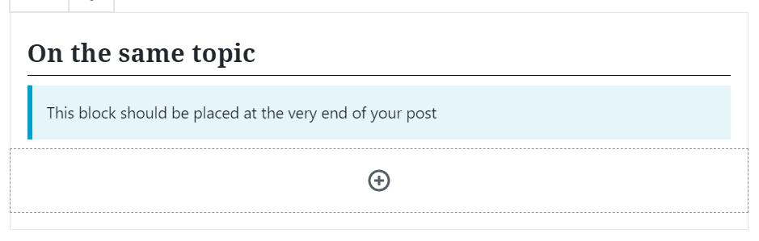
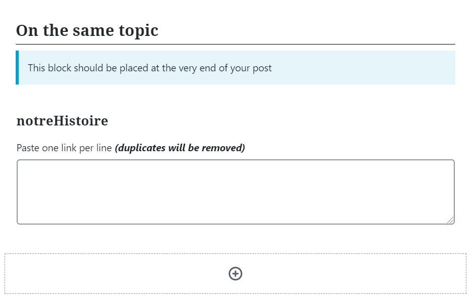
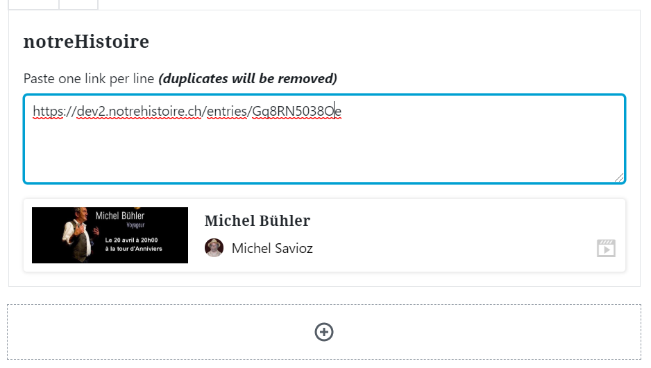

# Le bloc de liens "Sur le même sujet"

# Ajouter le bloc

Une fois ajouté, le bloc se présente sous la forme d'un bloc vide, contenant un bouton **(+).**

Cliquer sur le bouton en question permet d'ajouter l'un des sous-blocs suivants :

- **NH3 Links** : permet d'ajouter une section de liens provenant des différentes plateformes notreHistoire
- **RTS/SRF/RSI/RTR Links** : permet d'ajouter une section de liens provenant de l'utilisateur SSR des différentes plateformes notreHistoire

> Les deux sous-blocs fonctionnent de manière identique, et ne peuvent être ajoutés qu'une seule fois au sein d'un bloc **"On Topic" section**.

# Ajouter des liens

Une fois le sous-bloc ajouté, il se présente sous la forme d'un zone de saisie.

Les liens à coller dans cette zone de saisie sont des liens vers des pages des plateformes notreHistoire.

Il faut coller un seul lien sur chaque ligne de la zone de saisie. Un même lien ne peut pas être collé plus d'une fois.

Le bloc indique lorsque le lien saisie est erroné (selon les mêmes critères que les adresse des blocs d'intégration de document 

Lors que le lien est collé, le bloc affiche un résumé du document ciblé par ce lien en dessous du bloc, en indiquant :

- L'image de couverture pour de ce document (si elle existe)
- Le titre du document
- L'utilisateur ayant publié le document
- Le type de document (vidéo, audio, photo, récit, galerie)

Cliquer sur le résumé du document ouvre le document sur sa plateforme d'origine dans un nouvel onglet

**Vous pouvez coller autant de liens que vous le voulez dans un sous-bloc**