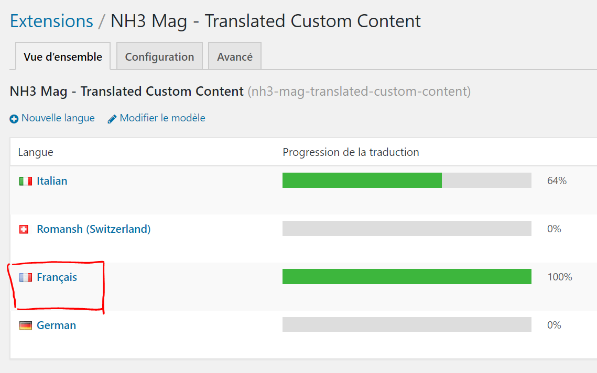
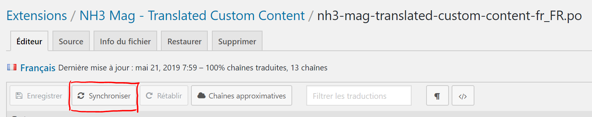
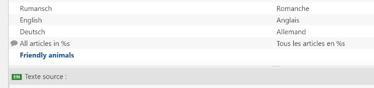
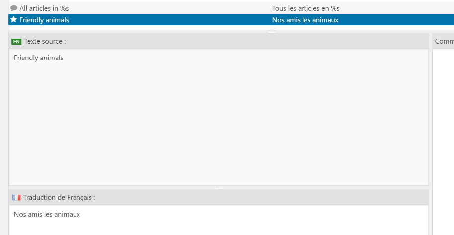
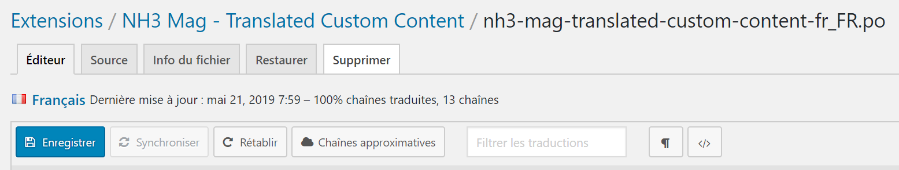
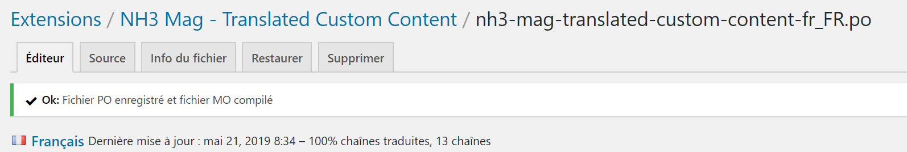
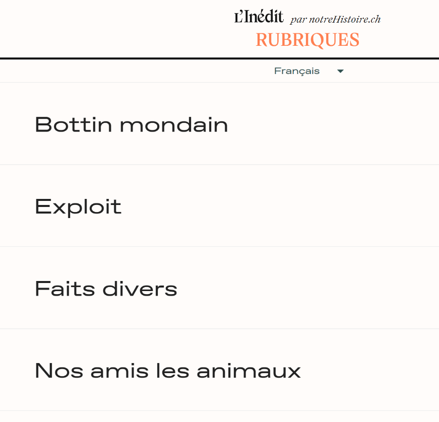

# Traduire le nom de la nouvelle catégorie

---

1. Dans l'administration du site, accéder à la page **Loco Translate > Extensions**

    

    ---

2. Dans la table qui s'affiche, cliquer sur l'extension **NH3 Mag - Translated Custom Content**

    ---

3. Dans la liste des langues à disposition, cliquer sur la langue dans laquelle le nom de la catégorie doit être traduit.
*Dans cet exemple, nous allons sélectionner la langue française.*

    

    Cliquer sur le nom de la langue souhaitée

    ---

4. Afin que les nouvelles entrées soient visibles dans la liste des traductions disponibles, cliquer sur le bouton **Synchroniser**, afin de récupérer les dernières modifications effectuées sur le modèle

    

    Le bouton permettant de mettre à jour les textes à traduire

    ---

5. Une fois la synchronisation effectuée, la nouvelle entrée se situe tout en base de la liste, et est affichée en gras, signe qu'elle ne possède pas encore de traduction *(ce qui est confirmé par l'absence de valeur pour cette ligne dans la colonne* Traduction *à droite).*

    

    La catégorie Friendly animals n'est pas traduite

    ---

6. Cliquer sur la nouvelle entrée pour la sélectionner, puis saisir la traduction pour ce texte dans le cadre prévu à cet effet nommé **Traduction de Français** *(le nom de ce cadre sera évidemment différent dans le cas d'une traduction en Italien ou Allemand).*

    *Notez à nouveau la présence de l'étoile* ⭐ *à côté du nom, indiquant que les modifications n'ont pas été enregistrées.*

    

    La traduction du nom de la catégorie

    ---

7. Pour terminer le processus de traduction, il ne reste plus qu'à enregistrer les modifications en cliquant sur le bouton **Enregistrer**

    

    Le bouton **Enregistrer**

    ---

8. Le message ci-dessous et la disparition de l'étoile ⭐ indiquent que la traduction a bien été enregistrée.

    

    ---

9. Il est maintenant temps de retourner sur le site et de recharger la page pour voir notre nouveau nom traduit.

    

> Ne pas oublier de sélectionner la même langue pour le site que celle dans laquelle le nom de la catégorie a été traduite.