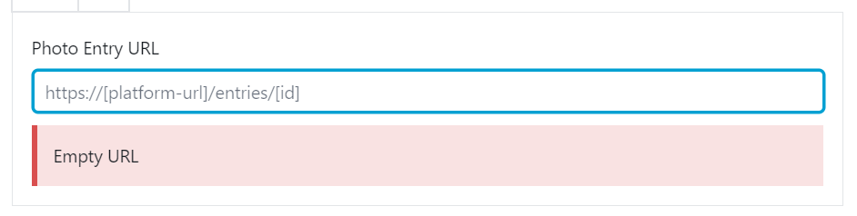

# Les blocs d'intégration de document

Il existe trois blocs permettant d'intégrer un document depuis une plate-forme NH3 :

* **Audio document** - Pour intégrer des documents audio
* **Photo document** - Pour intégrer des photos
* **Video document** - Pour intégrer des vidéos

> Bien que ce guide utilise l'exemple du **Photo document**, le fonctionnement des autres blocs, **Video document** et **Audio document**, est strictement identique

# Ajouter le bloc

Une fois ajouté à l'article, le bloc affiche un champ de saisie :

Ce champ attend une adresse d'un document provenant d'une des trois plateformes NH3 :

* `https://dev2.notrehistoire.ch`
* `https://dev.lanostrastoria.ch`
* `https://dev.nossaistorgia.ch`

Pour trouver l'adresse, naviguer sur la plateforme de son choix vers la page affichant le document de son choix ; l'adresse est celle affichée dans la barre d'adresse du navigateur :

Copier cette adresse

Il suffit de la copier puis de la coller dans le champ de saisie du bloc pour que ce dernier tente d'intégrer le document.

# Erreurs possibles

Le bloc indique lorsque la saisie effectuée est erronée :

* Si l'adresse saisie n'est pas une adresse valide

    

* Si l'adresse saisie n'est pas l'adresse d'un document du type choisit, ou ne cible pas un document existant

    

* Si aucune adresse n'a été saisie

    

# Intégration du document

Lorsque l'adresse saisie est correcte, le document est chargée dans l'article et il devient possible de saisir une légende et d'indiquer les crédits pour ce document.

**Il n'est pas nécessaire, ni conseillé, d'insérer le lien vers le document dans les crédits ou la légende ; l'adresse utilisée pour intégrer le document sera automatiquement rajoutée comme adresse de lien sur le crédit dans l'article publié.**
