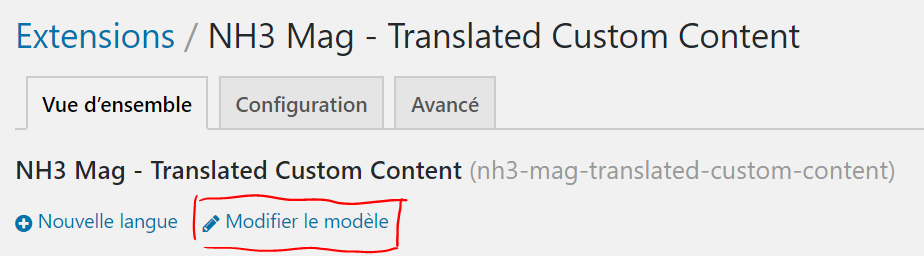
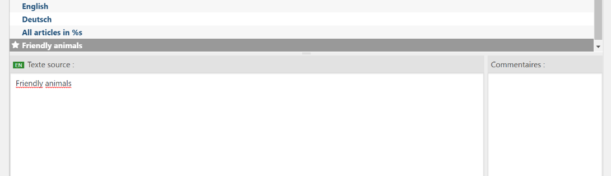
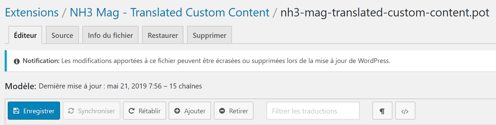
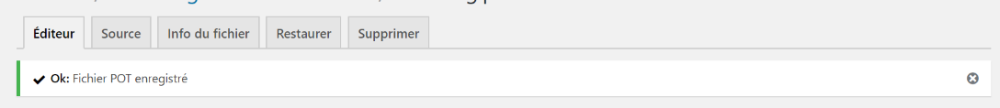

# Ajouter la nouvelle catégorie aux traductions

---

> Pour que la nouvelle rubrique puisse être traduite dans les différentes langues, il faut d'abord l'ajouter à l'ensemble des textes disponibles à la traduction. Pour ce faire, il faut suivre la procédure ci-dessous.

1. Dans l'administration du site, accéder à la page **Loco Translate > Extensions**

    

    ---

2. Dans la table qui s'affiche, cliquer sur l'extension **NH3 Mag - Translated Custom Content**

    ---

3. Sur la nouvelle page qui s'affiche, cliquer sur le lien **Modifier le modèle**

    

    _Le lien **Modifier le modèle**_

    ---

4. Sur la page suivante, cliquer sur le bouton **Ajouter**

    

    _Le bouton **Ajouter**_

    **ATTENTION !** Ne **JAMAIS** cliquer sur le bouton **Synchroniser** lors de la modification du modèle **pour l'extension NH3 Mag - Translated Custom Content** !
    **Ceci supprimerait toutes les entrées créées**.

    *Si cela devait malgré tout arriver, pas de panique : il vous suffirait de cliquer sur le bouton **Rétablir** pour revenir à l'état précédent.*

    ---

5. Ceci ajoute une nouvelle entrée, intitulée **New message** à la fin de la liste des textes disponibles.  Dans le cadre **Texte sources** sélectionner le contenu et le remplacer par **le nom anglais exact utilisé lors de la création de la catégorie. *Attention à bien respecter les majuscules/minuscules.***

    *Si nécessaire, il est possible d'ajouter un commentaire dans le cadre prévu à cet effet, afin d'indiquer que cette entrée désigne le nom d'une catégorie d'articles.*

    

    _Le_ "Texte source" _doit être le nom anglais exact de la catégorie_

    ---

6. L'entrée apparaît désormais avec un petit icône d'étoile ⭐ signifiant qu'il s'agit d'une nouveauté qui n'a pas encore été enregistrée.

    Il faut maintenant **sauver** les modifications grâce au bouton 💾 **Enregistrer.**

    

    _Cliquer sur le bouton bleu **Enregistrer** pour sauver les modifications_

    ---

7. Un message de validation, tel que celui ci-dessous, ainsi que la disparition de l'étoile ⭐à côté de l'entrée indiquent que les modifications ont bien été sauvegardées.

    

    _Message de validation_

    ---

> Le nom de la nouvelle catégorie est maintenant prêt à être traduit dans les différentes langues du site
