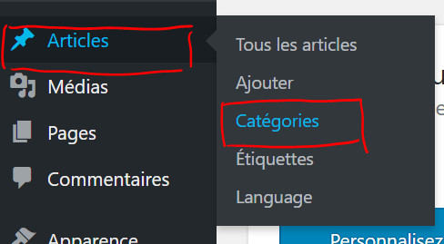
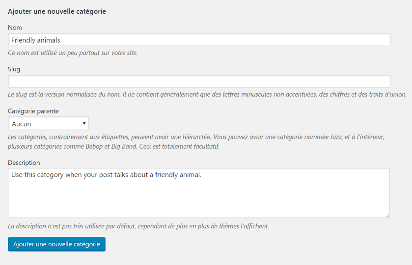
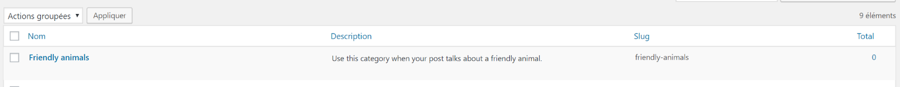
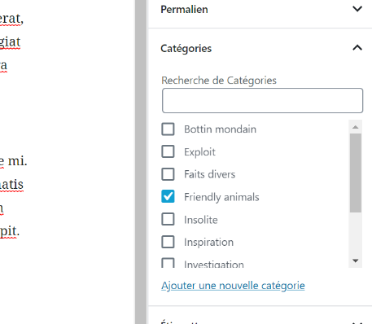
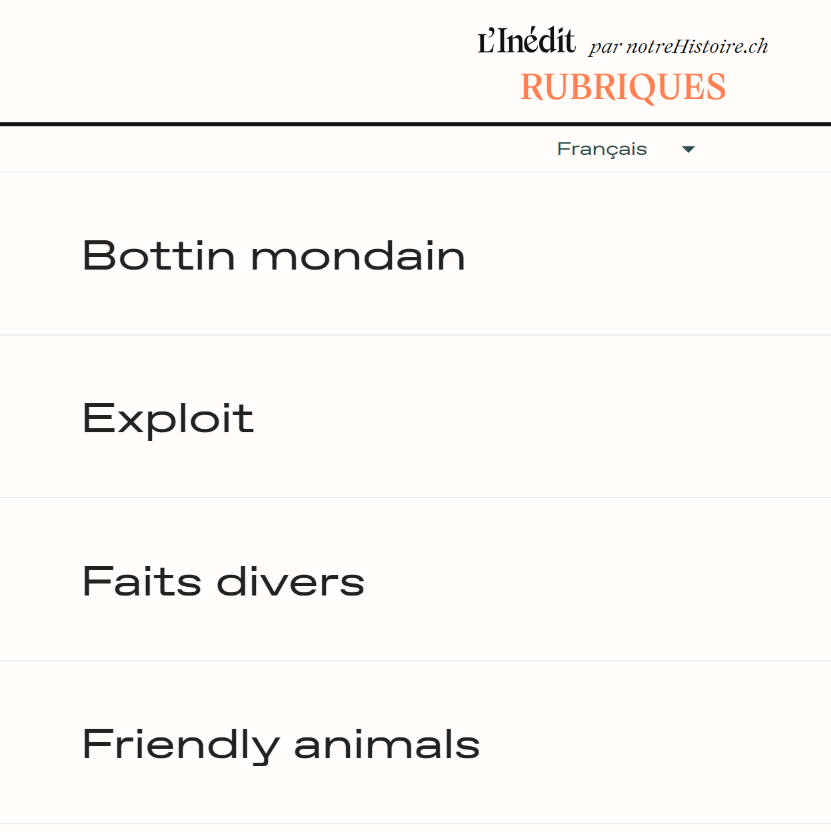

# Ajouter une nouvelle catégorie

---

1. Depuis le menu principal sur la gauche du site, accéder à la page **Articles > Catégories**

    

    _Accéder à la page des catégories_

    ---

2. Sur la page des catégories, remplir le formulaire de gauche avec les informations suivantes :
    - **Nom** : Le nom de la nouvelle catégorie. **Ce nom doit être écrit en Anglais !**
    - **Slug** : Laissez vide ; WordPress remplira seul ce champ avec la bonne valeur.
    - **Catégorie parente** : Laissez vide.
    - **Description** : Si vous le souhaitez, vous pouvez saisir ici une description pour la catégorie, qui permettra aux rédacteurs de savoir si leur article rentre dans cette catégorie. **La description doit être écrite en Anglais pour être comprise par tout le monde.**

    ---

3. Une fois le formulaire rempli, cliquer sur le bouton **Ajouter une nouvelle catégorie**

    

    _Le formulaire de création de catégorie rempli_

    ---

4. La nouvelle catégorie apparaît sur la droite de la page, dans la liste des catégories existantes.

    

    _La nouvelle catégorie_

    ---

5. Maintenant que la catégorie est créée, vous pouvez désigner un article comme étant de cette catégorie, **sans oublier d'indiquer la langue d'écriture de l'article**.

    

    _La nouvelle catégorie est disponible dans l'éditeur d'article_

    ---

6. Une fois l'article publié, la catégorie apparaît dans la page des rubriques sur le site web.

    

    _Liste des rubriques_

    ---

Comme nous pouvons le voir, le nom de la catégorie est en Anglais, alors que la langue sélectionnée pour le site est en Français.

> La prochaine étape serait de rendre le nom de cette nouvelle catégorie traduisible dans les différentes langues du site.
