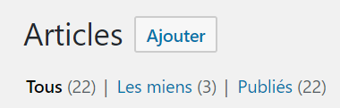

# Rédiger un article

# Création d'un nouvel article

Il existe trois moyens de créer un nouvel article :

1. Accéder à la page **Articles > Ajouter**

    

    ---

2. Accéder au menu **Créer > Article**

    

    ---

3. Cliquer sur le bouton **Ajouter** sur la page **Tous les articles**

    

    ---

> Ces trois méthodes ont le même effet : créer un nouvel article et ouvrir l'éditeur de texte de WordPress, nommé **Gutenberg**.

# Rédaction d'un article

L'éditeur de texte de WordPress utilise le concept de **bloc** pour représenter les différents éléments d'un article. Un titre est un bloc, un paragraphe est un bloc, une image est un bloc, etc.

Pour ajouter un bloc, trois possibilités :

1. Utilisez le bouton **(+)** en haut à gauche de l'éditeur

    

    ---

2. Utilisez le bouton **(+)** à gauche du bloc par défaut

    

    ---

3. Utilisez le bouton **(+)** qui apparaît lorsque la souris survol la limite supérieure d'un bloc

    

    ---

> Ces trois méthodes ont le même effet : afficher la sélecteur de bloc grâce auquel vous pouvez choisir le bloc qui vous intéresse.

# Blocs NH3

Certains blocs sont spécifiques aux besoins NH3. Ils sont disponibles sous la catégorie de blocs nommées **Blocs NH3** :

- **Video document** : permet d'intégrer un document vidéo depuis l'une des plateformes
- **Audio document** : permet d'intégrer un document audio depuis l'une des plateformes
- **Photo document** : permet d'intégrer un document photo depuis l'une des plateformes

    ---

    *La page ci-dessous détaille l'utilisation de ces blocs*

    [Les blocs d'intégration de document](../../blocks/integration)

    ---

- **"On Topic" section** : permet de rajouter une section "Sur le même sujet" (une seule fois par article)

    ---

    *La page ci-dessous détaille l'utilisation de ce bloc*

    [Le bloc de liens "Sur le même sujet"](../../blocks/on-topic)

    ---

# Ajouter une image mise en avant

Tous les articles rédigés sur L'Inédit sont supposés posséder une image mise en avant.

Pour accéder à ce réglage...

1. Afficher la barre latérale droite, si elle n'est pas déjà affichée, en utilisant le bouton ⚙️**Réglages** en haut à droite de l'éditeur

    

    ---

2. Cliquer sur l'onglet **Document** dans la barre latérale gauche pour accéder aux réglages du document

    

    ---

3. Descendre jusqu'à la section **Image mise en avant** et le développer s'il ne l'est pas déjà.

    Le bloc fonctionne exactement de la même manière que le bloc NH3 **Photo document.**

    

# Avant la publication

> Vous trouverez ci-dessous une liste d'éléments à vérifier avant de publier un article.

*Toutes ces vérifications sont à faire dans la barre latérale des* ⚙️**Réglages***, dans l'onglet du* **Document*.***

---

* [ ] Définir **une seule** catégorie en utilisant la section **Catégories**

    

* [ ] S'il s'agit d'un **article original**, ajouter l'étiquette `original` grâce à la section **Étiquettes**

    

* [ ] Indiquer la **langue** dans laquelle l'article a été rédigé grâce à la section **Languages**

    

* [ ] Définir une **Image mise en avant** en utilisant le réglage du même nom du **Document**
    *(cf. ci-dessus)*

---

Lorsque tous ces éléments sont vérifiés, l'article peut être publié en cliquant sur le bouton **Publier** en haut à droite de l'éditeur :

WordPress demande une confirmation de publication et permet notamment de modifier la date à laquelle l'article devra être publié.

Cliquer à nouveau sur **Publier** pour véritablement publier l'article.

