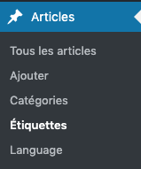
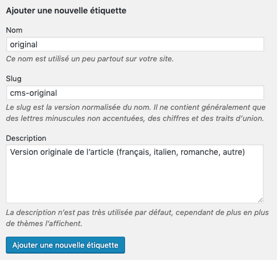

# Gestion des étiquettes

_Comment gérer les étiquettes d'articles._

> La suite de ce document présuppose que vous soyez connecté à l'interface d'administration du site de L'Inédit (lien ci-dessous).

[L'Inédit - Administration](https://mag.notrehistoire.ch/wp-admin)

La gestion des étiquettes est accessible depuis le menu principal du site sous **Articles > Étiquettes**:

## Étiquettes spéciales

Certaines étiquettes spéciales sont utilisées pour la gestion des articles par
le site. Par exemple, l'étiquette `original` indique qu'un article est une
version originale (non traduite).

Pour qu'une étiquette soit reconnue comme spéciale, son *Slug* doit être
configuré pour commencer par `cms-` (par exemple `cms-original`).

Lorsqu'un rédacteur ajoute une nouvelle étiquette à un article, le *Slug* est
automatiquement configuré sans ce préfixe. Les étiquettes spéciales devraient
donc être configurées à la main lors de la mise en place du site, avant de
rédiger des articles. Par exemple, voici comment remplir le formulaire pour
créer l'étiquette `original`:

Si besoin, le *Slug* peut aussi être modifié par la suite.

> **Attention:** certaines fonctionnalités du site comme la suggestion d'un
> article en relation se basent sur les étiquettes. Il est important de faire en
> sorte que le *Slug* des étiquettes spéciales commence par `cms-`, justement
> pour que le site les reconnaisse et les ignore dans ce genre de cas.

### Liste des étiquettes spéciales

Cette liste recense les étiquettes spéciales actuellement prévues dans le
fonctionnement du site, mais d'autres pourraient être ajoutées dans le futur
(tant que leur *Slug* commence par `cms-`):

* **`cms-original`** - Cette étiquette désigne un article dans sa version
  originale (français, italien, romanche ou autre) par opposition à une version
  traduite.