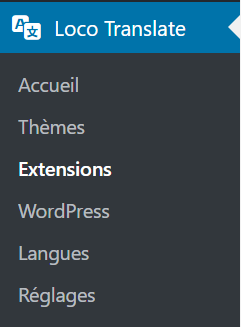
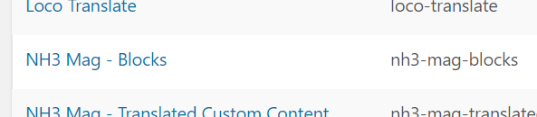
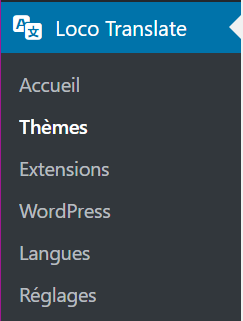
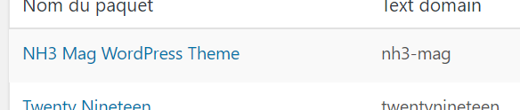

# Traduction du site

Comment traduire les textes affichés sur le site public

Le site de L'Inédit comporte un certain nombre de textes "statiques", tels que les éléments de menu ou de navigation, dont le contenu doit être différent selon la langue dans laquelle le site est lui-même affiché.

Les textes à traduire sont écrits dans le code des différents composants du site ; il ne vous est pas possible d'en rajouter sans aller modifier ce code.

En revanche, grâce au plugin **Loco Translate**, vous avez la maîtrise des traductions de ces textes.

> La suite de ce document présuppose que vous soyez connecté à l'interface d'administration du site de L'Inédit (lien ci-dessous).

[L'Inédit - Administration](https://mag.notrehistoire.ch/wp-admin)

# Emplacements des éléments à traduire

> Du fait de la manière dont le site de L'Inédit est construit, les textes à traduire se trouvent à des emplacements différents depuis le menu de **Loco Translate**.

### Traductions des textes des blocks NH3

Pour traduire les textes affichés sur le site dans les blocks NH3 (par exemple "Sur le même sujet"), accéder à la page **Loco Translate > Extensions**, puis cliquer sur l'extension **NH3 Mag - Blocks**.

### Traduction des textes du thème NH3

Pour traduire les textes affichés sur le site, accéder à la page **Loco Translate > Thèmes**, puis cliquer sur le thème **NH3 Mag WordPress Theme.**

# F.A.Q.

- **Où trouver le texte que je veux traduire ?**

    Si vous n'êtes pas sûr de l'emplacement où se trouve le texte que vous souhaitez traduire, regardez d'abord dans l'emplacement des **textes du thème NH3** ; il y a statistiquement plus de chances qu'il s'y trouve.

    Si vous ne l'y trouvez pas, alors il se trouve probablement dans l'emplacement des **textes des blocks NH3**.

# Traductions des textes

> Quel que soit l'emplacement, la procédure pour traduire les textes est identiques :

[Traduire les textes](./translate-texts)
