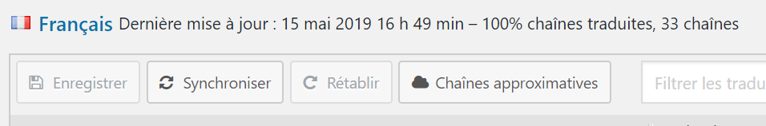

# Traduire les textes

> Pour ce guide, nous allons prendre comme exemple la traduction des éléments du thème.
>
> Nous supposons que vous êtes donc déjà sur la page des traductions du thème.

---

1. Dans la liste des langues à disposition, cliquer sur la langue pour laquelle le contenu devrait être traduit (*dans notre exemple, il s'agira du Français*) :

    

    _Cliquer sur le nom de la langue_

    ---

2. Si de nouveaux textes à traduire ont été rajoutés aux thèmes, ou que certains ont été supprimés, un message d'information tel que ci-dessous devrait s'afficher :

    

    **Dans ce cas**, mettre à jour les traductions en cliquant sur le bouton **Synchroniser** :

    

    _Cliquer sur **Synchroniser** pour mettre à jour les traductions par rapport au modèle_

    ---

3. Dans la liste des textes à traduire, les entrées non-traduites **sont colorées, en gras** et n'ont pas de valeur dans la colonne **Traduction**.

    *Les autres entrées ont déjà précédemment été traduites ; il est tout à fait possible de modifier ces traductions si besoin.*

    

    _Deux entrées ne sont pas traduites_

    Pour sélectionner l'entrée à traduire, cliquer sur son nom.

    ---

4. Voici les différents éléments importants à connaître pour une traduction:
    - **(1)** Certains textes disposent d'une note adressée aux traducteurs afin de préciser le contexte de cette traduction ou certains éléments particuliers.
    - **(2)** Le texte à traduire
    - **(3)** Il peut arriver que des commentaires ait été écrits pour ce texte. Si c'est le cas, ils apparaîtront ici
    - **(4)** Saisir ici le texte traduit

    

    ---

    > Le texte choisit dans cet exemple me permet de parler d'un point important concernant les traductions.

    *Il peut arriver que le texte à traduire contienne les caractères `%s`. Ceci arrive lorsque ce texte est amené à contenir une valeur différente selon le contexte dans lequel il est affiché sur le site.*

    *Par exemple, pour indiquer l'auteur d'un article, nous pourrions imaginer le texte suivant : "Article écrit par Marcel Rochat" ; ou "Article écrit par Jeanne Favre", selon l'auteur de l'article.*

    *Dans les deux cas, la partie à traduire se limite à "Article écrit par". Le texte à traduire sera donc "Article écrit par %s", où `%s` sera remplacé par le nom de l'auteur lorsque le texte sera affiché sur le site.*

    ***Lorsque un `%s` est présent dans un texte à traduire, une note pour les traducteurs devrait être présente pour indiquer par quoi sera remplacé ce `%s` sur le site (cf. (1) ci-dessus).***

    ***Le texte traduit DEVRA lui aussi posséder le `%s`.***

    ---

5. Dans la zone (4), saisir le texte traduit :

    

    _Noter la présence du `%s`_

    ---

6. Pour continuer à traduire d'autres textes, répéter les étapes **3** à **5**.

    ---

7. Une ⭐ étoile devrait apparaître à côté du nom des entrées modifiées dans la liste des textes à traduire. Cela signifie que les modifications ne sont pas encore enregistrées.

    

    _Trois entrées ont été modifiées ici_

    ---

8. Pour sauver les traductions effectuées, cliquer sur le bouton **Enregistrer** :

    

    ---

9. La présence de ce message et la disparition des ⭐ étoiles indiquent que les modifications ont été sauvegardées

    

    ---

10. Les textes traduits devraient désormais s'afficher sur le site !
